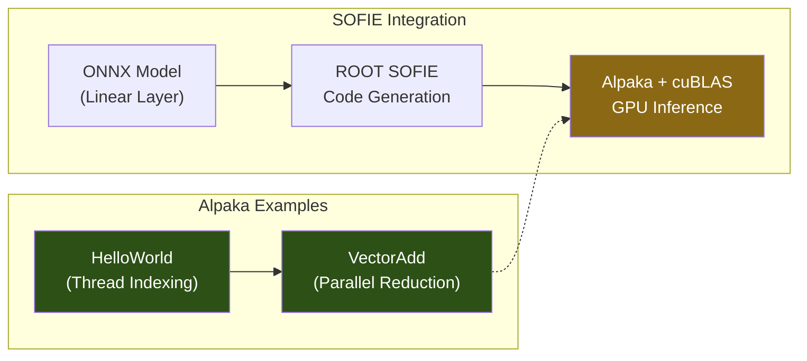

# ALPAKA Kernels

Example implementations and ONNX inference using the [Alpaka](https://github.com/alpaka-group/alpaka) parallel kernel abstraction library. Includes foundational examples (HelloWorld, VectorAdd) and a generated SOFIE linear layer running on GPU via Alpaka + cuBLAS.



## Contents

| File | Description |
|---|---|
| `helloWorld.cpp` | Alpaka HelloWorld — demonstrates grid/block/thread indexing, work division, and multi-backend execution |
| `vectorAdd.cpp` | Vector addition kernel — `uniformElements` iteration, host/device buffer management, timing |
| `Linear_from_ONNX.hxx` | SOFIE-generated linear layer (`y = Wx + b`) running on Alpaka + cuBLAS backend with device buffer management |

## Key Concepts Demonstrated

- **Backend Abstraction** — Same kernel code compiles for CUDA, HIP, OpenMP, and CPU threads
- **Thread Indexing** — `getIdx<Grid, Threads>` and `mapIdx<1u>` for linearization
- **Buffer Management** — `allocBuf`, `memcpy`, `createView` for host-device transfers
- **Work Division** — `uniformElements` for automatic workload distribution
- **SOFIE BLAS Integration** — cuBLAS GEMM calls through Alpaka queue abstraction

## Quick Start

### Prerequisites

- [Alpaka](https://github.com/alpaka-group/alpaka) installed
- C++17 compiler
- CUDA Toolkit (for GPU backend)
- cuBLAS (for Linear_from_ONNX)

### Build

```bash
# Using Alpaka's example build system
g++ -std=c++17 -I/path/to/alpaka/include helloWorld.cpp -o helloWorld
# or with CUDA backend via CMake (see alpaka documentation)
```

## Project Structure

```
ALPAKA-Kernels/
├── helloWorld.cpp         # Thread indexing and work division example
├── vectorAdd.cpp          # Parallel vector addition with timing
└── Linear_from_ONNX.hxx  # SOFIE-generated linear layer (Alpaka + cuBLAS)
```

## Tech Stack

- **C++17**
- **Alpaka** — Portable parallel kernel abstraction
- **CUDA / cuBLAS** — GPU backend
- **ROOT SOFIE** — ONNX model code generation

## Contributing

1. Fork the repository
2. Add new Alpaka kernel examples
3. Submit a pull request

## License

This project is available under the MIT License.
